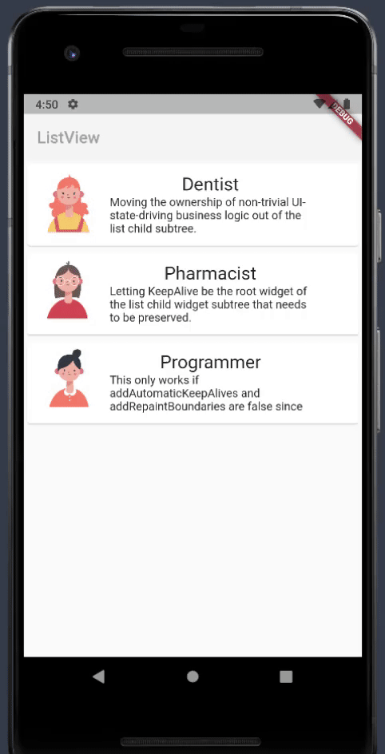

### old result

### 1.main

### 2.import_popup - 다른 파일에서 메서드를 호출하는 방식으로 코드 개선
1. 기존처럼 main 에서 _showPopup()를 호출하고
2. builder 이하의 return 되는 내용을 다른 파일에서 return 되는 부분에서 가져와서 실행할 수 있게 설정한다
3. 입력받은 속성과 생성자를 지정한다
4. 화면에 나타내기 위해 StatefulWidget 에 설정한 속성을 widget.userImage 로 가져온다
