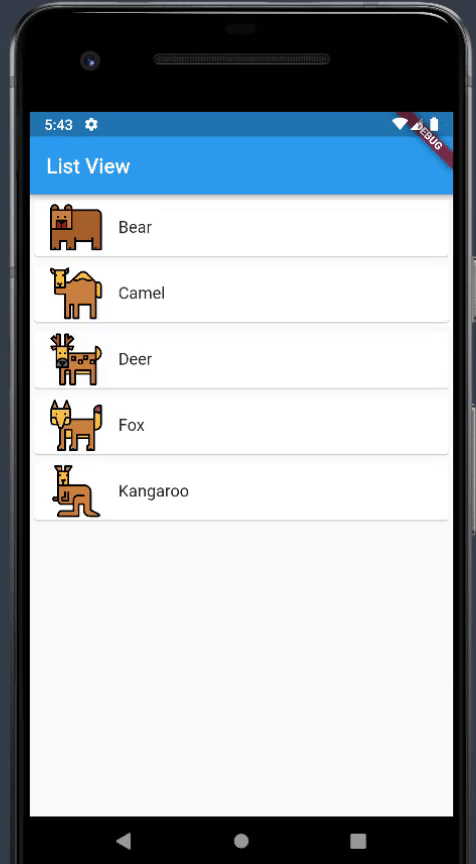

### result

### MVVM
1. M: model (외부에서 데이터를 받아올 때 서비스를 이용한다)
2. V: view (뷰는 상태 변경을 통지받아 화면을 업데이트한다)
3. VM: view model (뷰모델은 액션을 수행하고 자신의 상태를 업데이트한다)
4. MVVM 흐름도: https://www.notion.so/2023-646a2de6968f413ba8b3ab1ad07515cd?p=ec50d607ca9945158e92b1d85f740976&pm=c

### main
1. Animal model class 에는 객체를 생성하기 위한 속성을 설정하고
2. List.generate 를 사용하여 각각의 변수를 한개씩 순서대로 뽑아내서 넣어,
 이를 Animal model class 에 담아 객체로 생성할 것이다
3. ListView.builder 사용하여 클릭한 인덱스를 새로운 페이지에 나타낼 것이다

### model
1. Animal model class 에는 3개의 변수를 설정하고, 생성자를 지정한다

### pages
1. 부모로부터 받은 데이터를 자식에서는 생성자와 변수를 설정하여 가져오고
2. stl 인 경우 animal.name 으로,
   stf 인 경우 widjet.animal.name 으로 UI 에 나타낸다 

