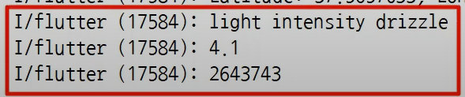
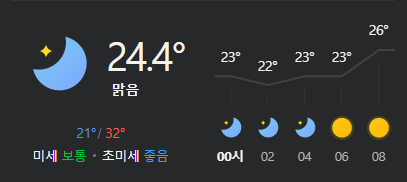

# main21

## 1.geo_location
1. geolocator 라이브러리 사용
2. 버튼 클릭 시, 내 위치의 위도와 경도를 가져오기 위한 설정

## 2.openweathermap_call_api - sample 데이터 사용
1. https://openweathermap.org/ , 날씨 정보 api 사용
2. 네트워크 통해서 json data 를 가져오기 위해 http 라이브러리 설치 
3. Uri.(parse, https 등등), response.body, jsonDecode 각각의 기능 이해
4. 아래 날씨 정보 3가지 (weather, wind, id)를 출력하기
5. 
7. Current weather data 를 활용할 것이며
- Call current weather data 를 사용하기 전에 테스트 하기 위한 글 하단에 sample data 를 활용한다
- https://api.openweathermap.org/data/2.5/weather?lat=44.34&lon=10.99&appid={API key} 
8. API key 는 사이트에서 생성하면 된다
9. fixme: LateInitializationError: Field 'products' has not been initialized.

## 시행 착오 - 2번 프로젝트
1. late final products 변수 설정 시, 앱 실행하면 products 는 비었으므로 UI 를 나타내지 못해 에러 뜬 뒤,
 initState 에 의해 앱 실행하면서 setState 처리한 부분에 products 가 설정되어 rebuild 되면서
 화면이 보여지고 있다. products 비었으면 빈 화면보여주고 데이터가 채워지면 화면 보여주려 한다.
2. Map<String, dynamic>? products 처리하여 null 올 수 있게 만들고
3. UI 에서 ${products['weather'][0]['description']} 대신 ${products?['weather'][0]['description']} 
 처리하여 데이터가 있을 때에만 화면에 나타내도록 설정하였다.

## 3. real_openweathermap_call_api - 실제 데이터 사용
### 앱 실행 즉시 현재 user 의 접속 위치와 대략적인 온도를 나타낸다

## 4.weather_screen

 
### 시행 착오
1. Expanded 는 Column 내에 존재해야 하는데,
 Expanded 는 child 을 받으므로 여러 개의 children 을 설정하지 못한다.
 그래서 Column 을 Expanded 로 감싸고 다시 Column 으로 감싼다.
 즉, Column 내에 Expanded 위젯과 Padding 위젯을 사용한다.
2. Diverder 위젯과 미세먼지 위젯도 최초 Column 위젯 안에 위치하며 
 Expanded 영역 밖에 위치해야 화면에 나타낼 수 있다 !

## 5.aqi_dust_call_api
1. 날씨 상태 SVG 와 문자열 기능 구현
2. 대기질, 미세 먼지, 초미세 먼지 기능 구현

### 시행 착오
1. widget.products 곧바로 UI 에서 가져와 사용하지 않고 State 내에 변수로 만들어서 사용하려 한다
 이유는 어떤 변수를 screen 에서 사용 했는지 한 번에 알 수 있기 때문이다.
 - witdet 을 실행할 수 있는 함수를 만들고 initState 에서 실행한다
2. 멤버변수와 생성자가 있는 경우와 Model 에 함수만 있는 경우의 차이점 이해하고 코드 수정
3. todo: 추 후 apikey 커밋한 부분부터 강제 삭제하고, env 설정하여 재업로드 하기

### n-screen

1. SVG 사용, 날씨 소숫점1자리까지, 도씨 표현, 맑음 나타내기, 미세먼지와 초미세 먼지 수치가 아닌 좋음/보통/나쁨으로 표현하기
2. 당일 최저온도/최고온도 표현하기 , 우측 그래프는 어떻게 표현할건지 ?