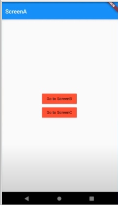

### 세부 
1. main.dart 에서 pushNamed 사용하여 route 처리할 것이다
2. main.dart 에 모든 페이지를 담을 것이다
3. second page 와 third page 를 만들 것이다
4. home page 에서 second page 로 이동하면 second page 화면을 보여주고
5. 상단 좌측에는 홈페이지로 이동하는 icon 을 만들 것이다